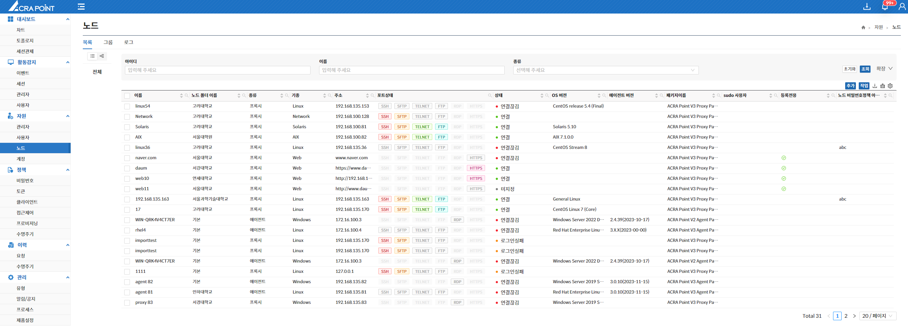
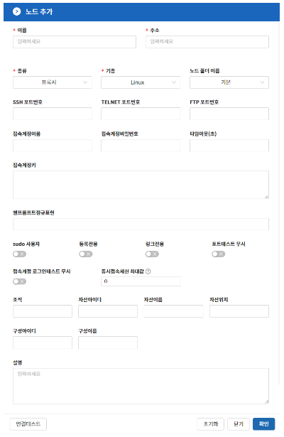
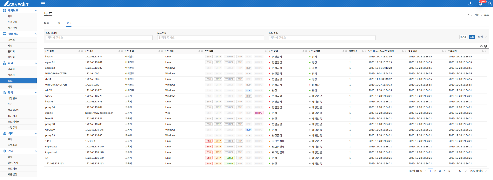

import Table from '/src/util/Table';
import NodeListFeatures from '/src/constant/NodeListFeatures';
import {AddingNodeLinuxOptions, AddingNodeNetworkOptions, AddingNodeWindowOptions, AddingNodeWebOptions} from '/src/constant/AddingNodeOptions';
import NodeGroupFeatures from '/src/constant/NodeGroupFeatures';
import Tabs from '@theme/Tabs';
import TabItem from '@theme/TabItem';

## 노드
해당 메뉴는 보안관리 인터페이스에서 ACRA Point의 노드를 보기 위한 것으로 노드 리스트를 볼 수 있는 목록과 노드를 그룹핑해 놓을 수 있는 그룹, 노드의 기록을 관찰할 수 있는 로그 탭을 제공한다.

## 목록
노드 목록은 보안관리 인터페이스에서 ACRA Point의 노드를 보기 위한 것으로 `List View`와 `Folder View`를 지원하며 아래와 같은 기능들을 제공한다. 

<Table tableData={NodeListFeatures}/>

<Tabs>
  <TabItem value="List View" label="List View" default>
	  
  </TabItem>
  <TabItem value="Folder View" label="Folder View">
	  

  ### 노드 폴더에 관리자 지정

  
노드 폴더에 관리자 지정하는 방법

  1. 노드 목록의 `Folder View`에서 관리자를 지정하고 싶은 노드 폴더를 우클릭한다.
  2. 관리자 지정을 클릭하고 관리자를 등록한다.

  

  :::info[정보]
  - 폴더 구조는 최대 10개 수준의 깊이(depth)로 제한한다.
  - 동일한 깊이(depth)에 위치한 폴더는 유일한 폴더명을 가져야 한다.
  :::

  :::note[참고]
  Folder View의 기능은 [7.2 사용자 목록](/docs/자원/7.2%20사용자/#폴더의-생성수정삭제)의 Folder View 기능과 동일하다.
  :::
  </TabItem>
</Tabs>

### 노드 추가
**추가** 버튼을 클릭하여 이름, 주소, 종류, 기종, 노드 폴더 이름, 설명, 등록전용, 링크전용, 포트테스트 무시를 공통으로 입력하고 선택한 기종에 따라 SSH 포트번호, RDP 포트번호, WinRM포트번호 등 선택적으로 입력해 노드를 추가할 수 있다.

#### 노드 폴더를 선택하고 노드를 추가했을 경우
 노드 폴더 이름이 자동으로 선택한 노드 폴더로 지정된다.

#### 노드 기종에 따른 옵션

<Tabs>
  <TabItem value="리눅스 / HPUX / AIX / Solaris" label="리눅스 / HPUX / AIX / Solaris" default>
    <Table tableData={AddingNodeLinuxOptions}/>
  </TabItem>
  <TabItem value="Network" label="Network">
    <Table tableData={AddingNodeNetworkOptions}/>
  </TabItem>
  <TabItem value="Window" label="Window" >
    <Table tableData={AddingNodeWindowOptions}/>
</TabItem>
  <TabItem value="Web" label="Web" >
    <Table tableData={AddingNodeWebOptions}/>
</TabItem>
</Tabs>

:::info[정보]
  각 포트번호는 미 입력시 [10.4 환경설정](/docs/관리/10.4%20제품설정/#환경설정)에서 등록한 값이 기본으로 저장된다.
:::

## 그룹

노드 그룹은 보안관리 인터페이스에 각 노드의 그룹을 보기 위한 것으로 동적 또는 정적으로 노드들을 그룹화 시키며 아래와 같은 기능들을 제공한다.

<Table tableData={NodeGroupFeatures}/>

### 노드 그룹 추가

#### 노드 그룹의 동적 여부

노드 그룹은 동적과 정적을 지원한다.

:::note[참고]
  노드 그룹의 동적 여부는 [7.2 사용자 역할의 동적 여부](/docs/자원/7.2%20사용자/#사용자-역할의-동적-여부)의 기능과 동일하다.
:::

#### 노드 그룹 색상 지정
컬러 피커를 사용해 노드 그룹의 색상을 지정할 수 있다.  

## 로그

노드 로그는 증적된 노드의 로그를 확인하는 페이지이다.

