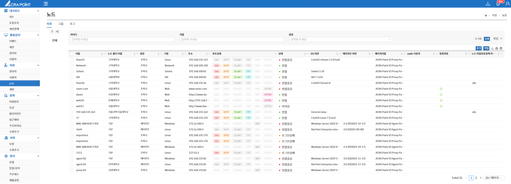
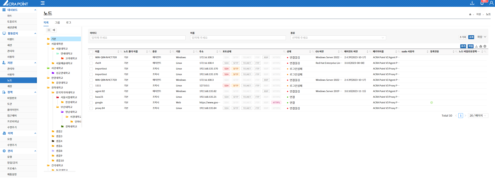
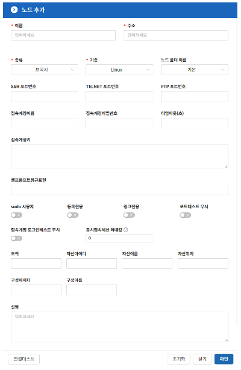

노드 목록은 보안관리 인터페이스에서 ACRA Point의 노드를 보기 위한 것으로 List View와 Folder View를 지원하며 상세보기, 노드 삭제, 폴더 지정, 계정 동기화, 무결성 검사, 접근 가능한 계정 보기, 정책 동기화, 비밀번호정책 지정 및 해제 기능을 제공한다.

  
< List View >

  
< Folder View >

- **폴더를 우클릭하여 해당 폴더의 관리자를 지정할 수 있다.**
- **Folder View의 기능은 7.2.1 사용자 목록의 Folder View 기능과 동일하다.**

&#45; **노드 추가**  
**“추가”** 버튼은 노드를 추가할 수 있는 기능으로 이름, 주소, 종류, 기종, 노드 폴더 이름, 설명, 등록전용, 링크전용, 포트테스트 무시를 공통으로 입력하고 선택한 기종에 따라 SSH 포트번호, RDP 포트번호, WinRM포트번호, 타임아웃, 기본 쉘프롬프트정규표현, 접속계정이름, 접속계정비밀번호, 접속키, sudo사용자, 등록전용, 접속계정 로그인테스트 무시, HTTPS 사용여부, 데이터베이스명 값 등을 입력하여 추가할 수 있다.

- **각 포트번호는 미 입력시 [10.4.1 환경설정](http://localhost:3000/docs/관리/10.4%20제품설정/10.4.1%20환경설정/)에서 등록한 값이 기본으로 저장된다.**  
- **sudo 사용자 옵션은 해당 계정에 sudo 권한을 부여할지 여부이다.**  
- **등록전용으로 설정된 노드는 계정 Recon이 일어나지 않고 계정 등록만 가능하다.**  
- **링크전용으로 설정된 노드는 룰셋 적용 및 세션 현황에 표시되지 않고 계정 연결만 가능하다.**  
- **포트테스트 무시로 설정된 노드는 포트 연결 테스트를 하지 않는다.**  
- **접속계정 로그인테스트 무시로 설정된 노드는 포트 연결 테스트를 하지 않는다.**  
	* 로그인 정보를 포함한다는 점에서 포트테스트 무시와 차이점을 가지고 있다.
