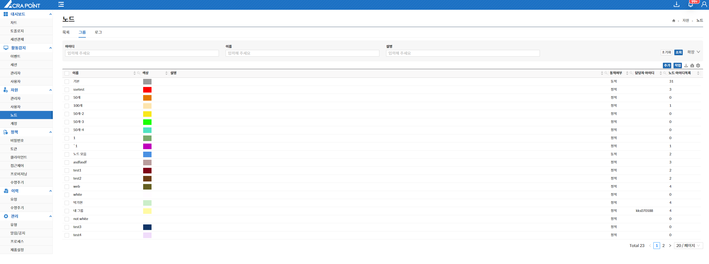

노드 그룹은 보안관리 인터페이스에 각 노드의 그룹을 보기 위한 것으로 선택 또는 동적조건으로 노드들을 그룹화 시키는 기능을 제공하며, 그룹 상세보기, 그룹 삭제, 멤버 보기, 담당자 지정 및 해제 기능을 제공한다.

- **멤버보기를 통해 해당 그룹에 속한 노드들을 볼 수 있다**

&#45; **노드 그룹 추가**

- **노드 그룹의 색상을 지정할 수 있다.**  
- **정적 / 동적으로 노드를 추가할 수 있다.**  
- **동적 추가는 [7.2.2 사용자 역할](http://localhost:3000/docs/자원/7.2%20사용자/7.2.2%20역할/)의 동적 기능을 참고한다.**  
