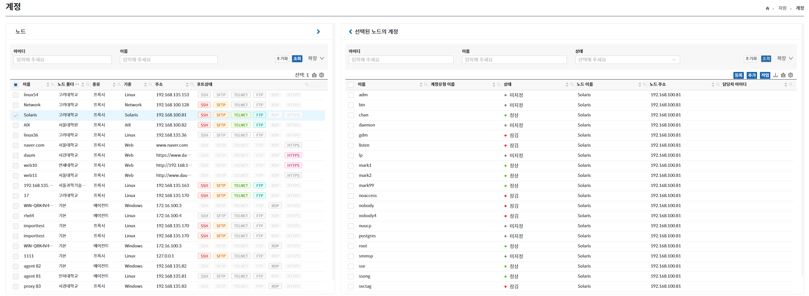

## 계정
계정 페이지는 보안관리 인터페이스에서 ACRA Point 관리서버에 등록된 각 노드에 대한 계정을 보기 위한 것으로 선택한 노드에 대한 계정을 조회할 수 있다.

계정의 성격에 따라 계정 제거, 계정 삭제, 잠금, 잠금 해제, 비밀번호 변경, 비밀번호 지정, 비밀번호 지정 해제, 비밀번호 보기, 담당자 지정, 담당자 지정 해제, 비공개키 지정, 비공개키 지정 해제, 유형 지정, 유형 지정 해제 기능을 제공한다.

### 계정 조회
좌측 노드 리스트에서 노드를 선택한 후 우측 상단의 **조회** 버튼을 클릭 시 해당 노드의 계정들이 리스트업 된다.

- **계정 조회가 되면 좌측 노드 선택창의 체크박스는 비활성화된다**  
- **선택된 노드 변경하려면 우측 상단의 초기화 버튼을 클릭한다.**  

### 계정 추가 / 등록
계정 **추가 / 등록** 버튼은 한 개의 노드가 선택되었을 경우에만 노출되며 등록과 추가가 모두 가능하면 둘 다 노출되고 등록만 가능하면 **등록** 버튼만 노출된다.

:::info[정보]
계정 등록은 Recon 되지 않은 노드의 OS계정을 보안관리 인터페이스에 등록하는 과정이다
:::

