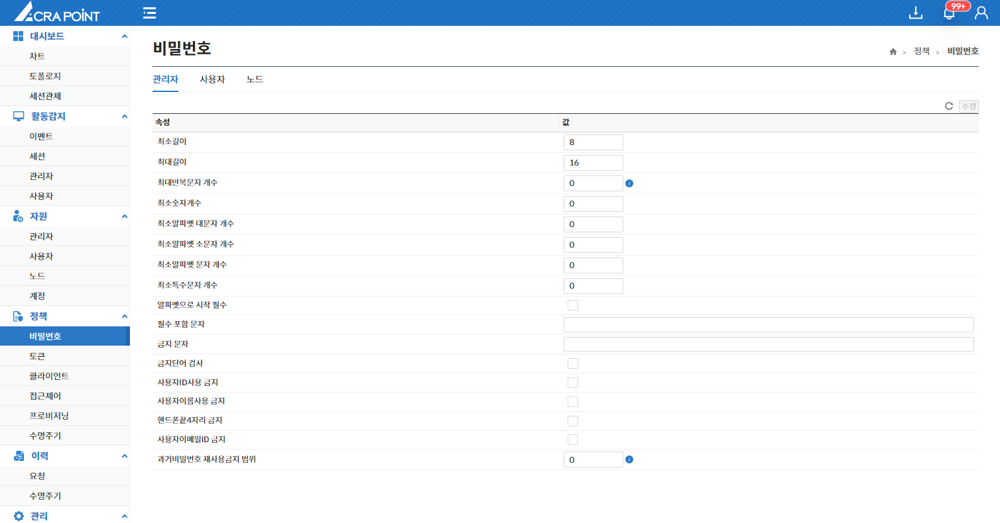
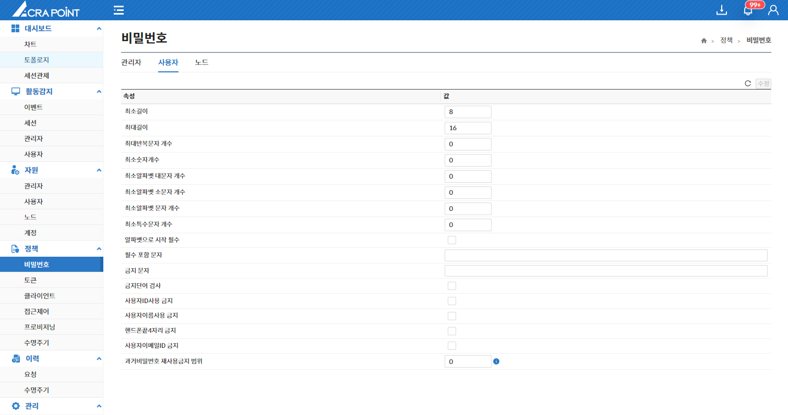
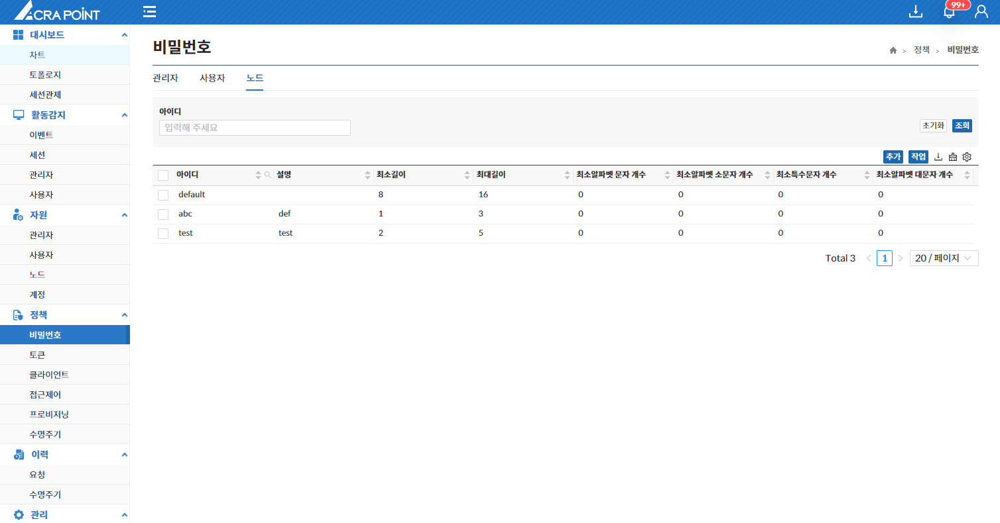
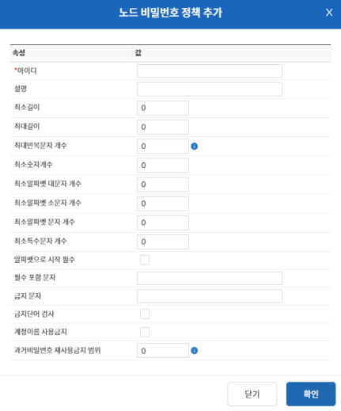

import RefreshSvg from '/static/img/refresh.svg'

## 관리자
해당 메뉴는 보안관리 인터페이스에서 ACRA Point 관리서버에 등록된 관리자 비밀번호 정책을 보는 페이지이며 수정이 가능하다.

- 수정된 내역이 있는 경우에만 **수정** 버튼이 활성화 된다.
- **수정** 버튼을 클릭하지 않고 <RefreshSvg/> 버튼 클릭시 현재 수정된 내역이 원상복귀 된다.

:::note[예시]
비밀번호 정책 예시
1. 정책이 최소길이가 8, 최대길이가 16인 경우  
    - 비밀번호 `example`은 사용할 수 없다.
    - 비밀번호 `example123`은 사용할 수 있다.

2. 정책이 필수 포함 문자가 test인 경우
    - 비밀번호 `tost123`은 사용할 수 없다.
    - 비밀번호 `test123`은 사용할 수 있다.
:::

:::info[정보]
개수와 범위값에서 0은 검사하지 않음을 의미한다.
:::

## 사용자
해당 메뉴는 보안관리 인터페이스에서 ACRA Point 관리서버에 등록된 사용자 비밀번호 정책을 보는 페이지이며 수정이 가능하다.

- 수정된 내역이 있는 경우에만 **수정** 버튼이 활성화 된다.
- **수정** 버튼을 클릭하지 않고 <RefreshSvg/> 버튼 클릭시 현재 수정된 내역이 원상복귀 된다.

:::note[예시]
비밀번호 정책 예시
1. 정책이 최소알파벳 문자 개수가 4, 최소특수문자 개수 4인 경우  
    - 비밀번호 `example!@#`은 사용할 수 없다.
    - 비밀번호 `example!@#$%^`은 사용할 수 있다.

2. 정책이 금지 문자가 test인 경우
    - 비밀번호 `tost123`은 사용할 수 있다.
    - 비밀번호 `test123`은 사용할 수 없다.
:::

:::info[정보]
개수와 범위값에서 0은 검사하지 않음을 의미한다.
:::

## 노드
해당 메뉴는 보안관리 인터페이스에서 ACRA Point 관리서버에 등록된 노드 비밀번호 정책을 보는 페이지이며 여러개 추가가 가능하다.

  

### 노드 비밀번호 정책 추가

  

:::note[예시]
비밀번호 정책 예시
1. 정책이 최소숫자 개수가 4, 알파벳으로 시작이 활성화된 경우  
    - 비밀번호 `1234example`은 사용할 수 없다.
    - 비밀번호 `example1234`은 사용할 수 있다.

2. 정책이 계정이름 사용 금지가 활성화된 경우
    - 계정 이름이 user인 경우, 비밀번호 `user123`을 사용할 수 없다.
    - 계정 이름이 user인 경우, 비밀번호 `test123`을 사용할 수 있다.
:::

:::tip[팁]
해당 페이지에서 추가된 노드 비밀번호 정책은 노드 페이지에서 원하는 노드에 적용 가능하다.
:::
