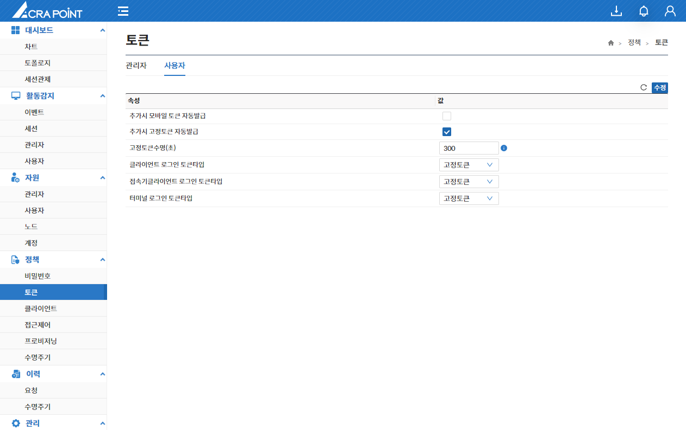

import RefreshSvg from '/static/img/refresh.svg'
import Tabs from '@theme/Tabs';
import TabItem from '@theme/TabItem';

## 관리자

해당 메뉴는 보안관리 인터페이스에서 ACRA Point 관리서버에 등록된 관리자 토큰 정책을 보기 위한 것으로 수정 가능하다.

### 클라이언트 로그인 토큰타입

<Tabs>
  <TabItem value="고정토큰" label="고정토큰" default>
    고정토큰은 변하지 않는 토큰으로, 사용자마다 임의로 가지고 있는 고정된 토큰이다.
  </TabItem>
  <TabItem value="모바일토큰" label="모바일토큰">
    모바일토큰은 변하는 토큰으로, 사용자마다 임의로 가지고 있는 변하는 토큰이다.
  </TabItem>
</Tabs>

:::info[정보]
시간값에서 0은 무제한을 의미한다.
:::

- 수정된 내역이 있는 경우에만 **수정** 버튼이 활성화 된다.
- **수정** 버튼을 클릭하지 않고 <RefreshSvg/> 버튼 클릭시 현재 수정된 내역이 원상복귀 된다.

## 사용자
해당 메뉴는 보안관리 인터페이스에서 ACRA Point 관리서버에 등록된 사용자 토큰 정책을 보기 위한 것으로 수정 가능하다.

### 클라이언트 로그인 토큰타입

<Tabs>
  <TabItem value="고정토큰" label="고정토큰" default>
    고정토큰은 변하지 않는 토큰으로, 사용자마다 임의로 가지고 있는 고정된 토큰이다.
  </TabItem>
  <TabItem value="모바일토큰" label="모바일토큰">
    모바일토큰은 변하는 토큰으로, 사용자마다 임의로 가지고 있는 변하는 토큰이다.
  </TabItem>
</Tabs>

:::info[정보]
시간값에서 0은 무제한을 의미한다.
:::

- 수정된 내역이 있는 경우에만 **수정** 버튼이 활성화 된다.
- **수정** 버튼을 클릭하지 않고 <RefreshSvg/> 버튼 클릭시 현재 수정된 내역이 원상복귀 된다.
