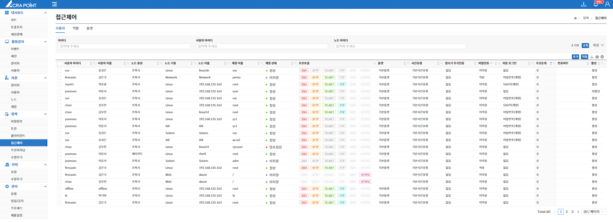
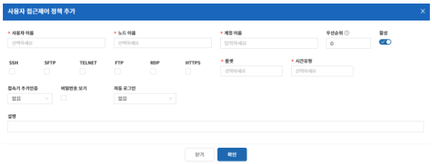

## 사용자
해당 메뉴는 보안관리 인터페이스에서 ACRA Point 관리서버에 등록된 사용자 접근제어 정책을 보기 위한 것으로 사용자 접근제어 정책 삭제 기능을 제공한다.

### 사용자 접근제어 정책이란?  
사용자가 ACRA Point 관리서버에 등록된 노드에 접근하기 위한 정책이며 어떤 사용자가 어떤 노드에 어떤 계정으로 접근할 것인지에 대한 정책을 설정하는 것이다.

### 사용자 접근제어 정책 추가
해당 사용자가 어떤 노드에 어떤 계정으로 접근을 할 수 있고 어떠한 규칙을 설정하는지를 생성한다.

- `우선순위`를 `0`부터 `99`까지 설정할 수 있고, `0`이 **가장 높은 우선 순위**이다.
- `룰셋`은 기존에 생성된 `룰셋`을 선택하거나 직접 입력할 수 있다.
- `시간유형`은 기존에 생성된 `시간유형`을 선택하거나 직접 입력할 수 있다.
- `고정토큰`, `모바일토큰`, `임시비밀번호`를 사용해 **접속기 추가인증**을 할 수 있다.
- 계정 페이지에서 노드의 비밀번호를 지정하고, 비밀번호 보기 정책을 활성화하면 접속기에서 해당 노드의 **비밀번호 보기**를 할 수 있다.  
- 노드 기종에 따라 비밀번호, `SSH키`를 사용해 **자동 로그인**을 할 수 있다.

## 역할
해당 메뉴는 보안관리 인터페이스에서 ACRA Point 관리서버에 등록된 역할 접근제어 정책을 보기 위한 것으로 역할 접근제어 정책 삭제 기능을 제공한다.

### 역할 접근제어 정책이란?
역할이 ACRA Point 관리서버에 등록된 노드에 접근하기 위한 정책이며 다양한 역할을 할 수 있는 어떤 사용자들이 어떤 노드에 어떤 계정으로 접근할 것인지에 대한 정책을 설정하는 것이다.

### 역할 접근제어 정책 추가
해당 사용자역할에 속한 사용자들이 어떤 노드에 어떤 계정으로 접근을 할 수 있고 어떠한 규칙을 설정하는지를 생성한다.

 :::note[참고]
 우선순위, 룰셋, 시간유형, 접속기 추가인증, 비밀번호 보기, 자동 로그인은 [8.4 사용자 접근제어](#사용자) 정책 추가 기능과 동일하다.
 :::

 ## 룰셋
 해당 메뉴는 보안관리 인터페이스에서 ACRA Point 관리서버에 등록된 룰셋을 보기 위한 것으로 룰셋 삭제, 룰셋 복사 기능을 제공한다.

### 룰셋이란?
다양한 규칙들의 집합체이며 각 룰셋은 다른 정책에서 함께 사용될 수 있다.

### 룰셋 추가 
각 항목들에 맞게 원하는 설정을 추가하거나 선택한다.

- `Default`로 **기본룰셋을 상속**받는다.  
    (상속을 받지 않으려면 해당 항목의 `상속거부`를 체크한다.)
- `명령어 규칙`은 기본이 `허용`이다.
- `SU허용규칙`은 기본이 `금지`이다.
- `파일 관련 정`책은 기본이 `금지`이다.
- `우선순위`는 **기본정책이 가장 높다**.

### 룰셋 복사
복사하고 싶은 룰셋을 선택하여 룰셋을 복사한다.

:::info[정보]
복사된 룰셋의 이름은 자동으로 복사한 룰셋 이름의 사본으로 설정된다.  

ex. `기본룰셋` 복사 시 복사된 룰셋의 이름은 `기본룰셋의 사본`으로 설정된다.
:::
