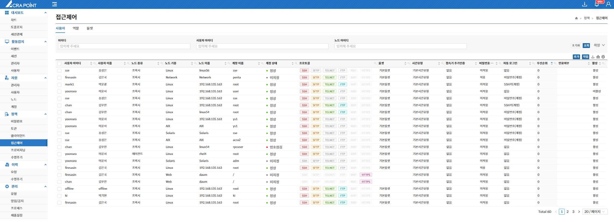
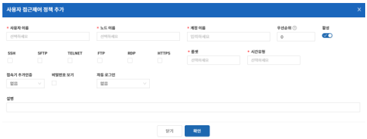

해당 메뉴는 보안관리 인터페이스에서 ACRA Point 관리서버에 등록된 사용자 접근제어 정책을 보기 위한 것으로 사용자 접근제어 정책 삭제 기능을 제공한다.

사용자 접근제어 정책이란, 사용자가 ACRA Point 관리서버에 등록된 노드에 접근하기 위한 정책이며 어떤 사용자가 어떤 노드에 어떤 계정으로 접근할 것인지에 대한 정책을 설정하는 것이다.

&#45; **사용자 접근제어 정책 추가**  
해당 사용자가 어떤 노드에 어떤 계정으로 접근을 할 수 있고 어떠한 규칙을 설정하는지를 생성한다.

- **우선순위를 0부터 99까지 설정할 수 있고, 0이 가장 높은 우선 순위이다.**  
- **룰셋은 기존에 생성된 룰셋을 선택하거나 직접 입력할 수 있다.**  
- **시간유형은 기존에 생성된 시간유형을 선택하거나 직접 입력할 수 있다.**  
- **고정토큰, 모바일토큰, 임시비밀번호를 사용해 접속기 추가인증을 할 수 있다.**  
- **계정 페이지에서 노드의 비밀번호를 지정하고, 비밀번호 보기 정책을 활성화하면 접속기에서 해당 노드의 비밀번호 보기를 할 수 있다.**  
- **노드 기종에 따라 비밀번호, SSH키를 사용해 자동 로그인을 할 수 있다.**  
