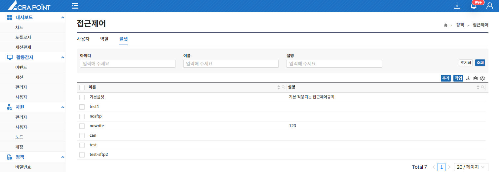
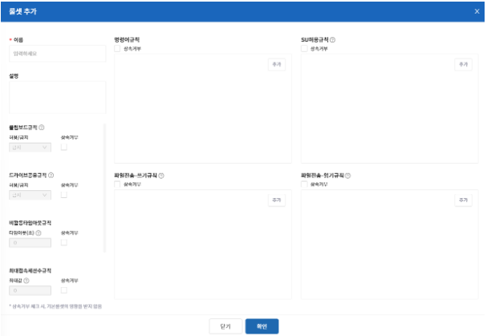
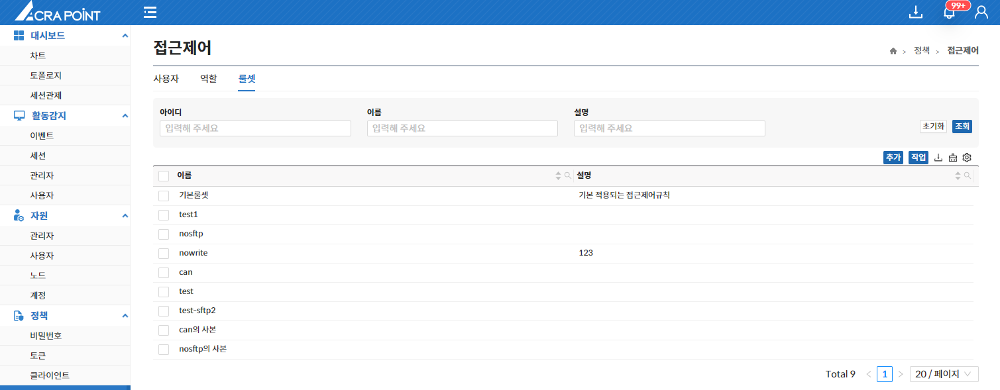

해당 메뉴는 보안관리 인터페이스에서 ACRA Point 관리서버에 등록된 룰셋을 보기 위한 것으로 룰셋 삭제, 룰셋 복사 기능을 제공한다.

룰셋이란, 다양한 규칙들의 집합체이며 각 룰셋은 다른 정책에서 함께 사용될 수 있다.

&#45; **룰셋 추가**  
각 항목들에 맞게 원하는 설정을 추가 or 선택한다.

- **Default로 기본룰셋을 상속받는다.**  
    **(상속을 받지 않으려면 해당 항목의 “상속거부”를 체크한다.)**  
- **명령어 규칙은 기본이 허용이다.**  
- **SU허용규칙은 기본이 금지이다.**  
- **파일 관련 정책은 기본이 금지이다.**  
- **우선순위는 기본정책이 가장 높다.**  

&#45; **룰셋 복사**  
복사하고 싶은 룰셋을 선택하여 룰셋을 복사한다.

- **복사된 룰셋의 이름은 자동으로 복사한 룰셋 이름의 사본으로 설정된다.**
