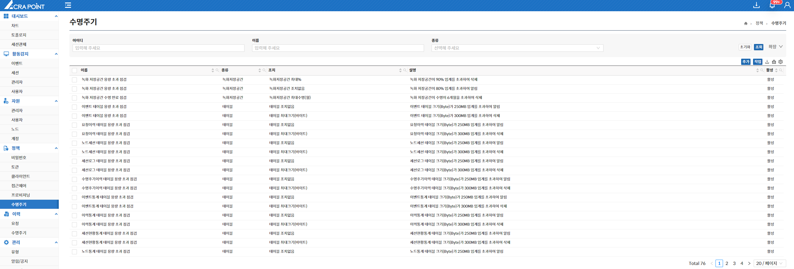

해당 메뉴는 보안관리 인터페이스에서 ACRA Point 관리서버에 등록된 프로비저닝 정책을 보기 위한 것으로 수명주기 정책 추가/수정/삭제/즉시 실행 기능을 제공한다.

- **수명주기 정책은 해당 기간동안 정해진 시간대에 정해진 반복시간으로 주어진 조건에 맞는 동작을 취하는 정책이다.**  
- **즉시 실행을 통해 생성된 수명주기 정책을 바로 실행할 수 있다.**  

&#45; **수명주기정책 추가**  

- **선택한 작업 종류에 따라 하위 메뉴는 해당 작업 종류에 맞게 변경된다.**
