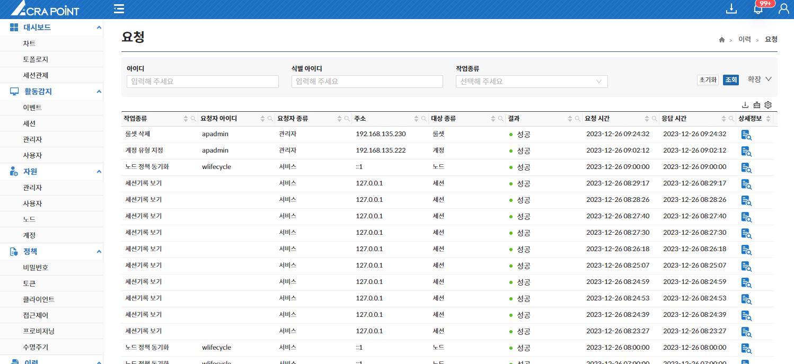
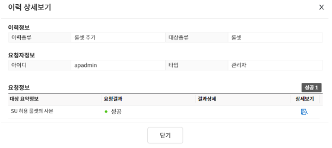
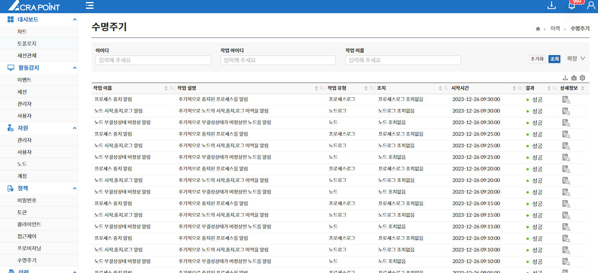
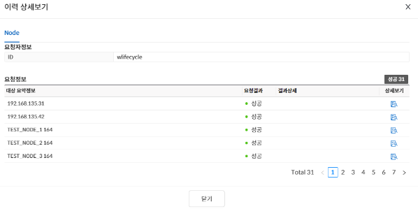

## 이력
해당 메뉴는 보안관리 인터페이스에서 수행되는 작업 내역을 시간 순서대로 기록하여 보여준다.

## 요청
보안관리 인터페이스에서 ACRA Point 관리서버에 등록된 이력을 보기 위한 것으로 자원에 의해 수행되는 작업 내역을 시간 순서대로 확인 가능하며 이력 상세보기 기능을 제공한다.

### 이력 상세보기
이력정보, 요청자정보, 요청정보를 확인할 수 있다.

## 수명주기
해당 메뉴는 수명주기 정책에 의해 수행되는 작업 내역을 시간 순서대로 보기 위한 것으로 이력 상세보기 기능을 제공한다.

### 이력 상세보기
상세정보가 존재하는 항목만 상세보기가 가능하다.

